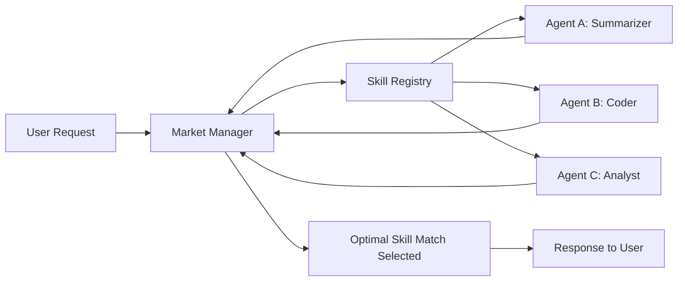

# Multi-Agent Skill Markets: Dynamic Capability Exchange

This repository accompanies the article **"Multi-Agent Skill Markets: Designing Dynamic Capability Exchanges Among AI Agents"**.

It provides a minimal reference implementation of a **skill market** where specialized agents *bid* to handle a task. A `MarketManager` selects the best match using simple, explainable heuristics (or an LLM if available).

> ✅ By default, the demos run in **mock mode** (no API keys required).  
> 🔑 If you set `OPENAI_API_KEY`, the market can request LLM help for tie-breaking (optional).

## Features
- Skill registry & discovery
- Bidding protocol (utility estimate, confidence, expected cost)
- Market selection strategy with transparent rationale
- Example agents: `SummarizerAgent`, `CoderAgent`, `AnalystAgent`

## Quickstart
```bash
python -m venv .venv && source .venv/bin/activate
pip install -r requirements.txt
python examples/run_market_demo.py --task "Generate a bullet-point summary of reflexive agents."
python examples/performance_report.py
```

## Concept Diagram (Mermaid)


## Repository Structure
```
multi-agent-skill-market/
├─ README.md
├─ requirements.txt
├─ src/
│  ├─ main.py
│  ├─ market_manager.py
│  ├─ agent_base.py
│  ├─ skill_registry.py
│  └─ bidding_protocol.py
└─ examples/
   ├─ run_market_demo.py
   └─ performance_report.py
```

## License
MIT
