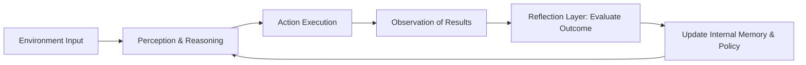

# Reflexive AI Agents: Closing the Loop Between Perception and Self-Evaluation

This repository accompanies the article **"Reflexive AI Agents: Closing the Loop Between Perception and Self-Evaluation"**.

It demonstrates a minimal, production-minded scaffold for a *reflexive agent* that performs a task, observes the outcome, **reflects** on its reasoning, and updates internal memory/policy hints.

> ✅ By default, the demos run in **mock mode** (no API keys required).  
> 🔑 If you set `OPENAI_API_KEY`, the same code paths will call a live LLM via the OpenAI API (optional).

## Features
- Reflexive loop: Perception → Action → Observation → Reflection → Memory update
- Pluggable `ReflectionLayer` with a naive scorer (mock) or LLM-based critique (if key is provided)
- Lightweight `MemoryManager` with recency and simple similarity signals
- Clean, testable Python modules

## Quickstart
```bash
python -m venv .venv && source .venv/bin/activate  # or .venv\Scripts\activate on Windows
pip install -r requirements.txt
python examples/run_reflective_chat.py --task "Summarize the benefits of reflexive agents."
python examples/evaluate_reflection_quality.py
```

If you have an OpenAI key and want to enable live calls:
```bash
export OPENAI_API_KEY=sk-...
# or set it in your shell/profile
```

## Concept Diagram (Mermaid)


## Repository Structure
```
reflexive-ai-agents/
├─ README.md
├─ requirements.txt
├─ src/
│  ├─ main.py
│  ├─ agent_reflexive.py
│  ├─ memory_manager.py
│  └─ reflection_layer.py
└─ examples/
   ├─ run_reflective_chat.py
   └─ evaluate_reflection_quality.py
```

## License
MIT
