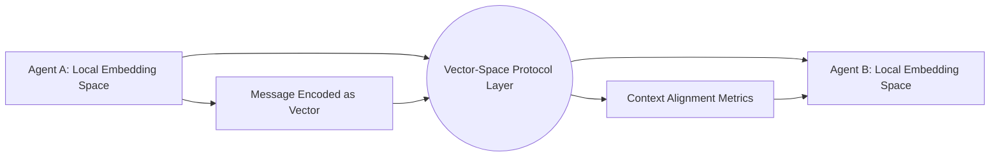

# Vector-Space Protocols — Building Shared Context Between AI Agents

A reference scaffold for the article **"Vector-Space Protocols — Building Shared Context Between AI Agents"**.
This repo demonstrates a minimal **Vector-Space Protocol (VSP)** for agent-to-agent communication using
shared embeddings, alignment handshakes, and semantic drift monitoring — implemented with offline-friendly
components (no API keys needed).

## Features
- Simple `Agent` class that communicates via vector messages.
- **VSP layer** providing: encoding, similarity checks, and an alignment handshake.
- **Metrics** to quantify semantic agreement and drift over time.
- Example demo script to run end-to-end locally.
- PyTest tests.

## Quickstart
```bash
python -m venv .venv && source .venv/bin/activate  # On Windows: .venv\Scripts\activate
pip install -r requirements.txt
python examples/demo_handshake.py
pytest -q
```

## Mermaid Diagram (Hero)


## Repo Layout
```
vector-space-protocols/
  ├─ LICENSE
  ├─ requirements.txt
  ├─ .gitignore
  ├─ README.md
  ├─ src/
  │   ├─ agents.py
  │   ├─ vsp.py
  │   └─ metrics.py
  ├─ examples/
  │   └─ demo_handshake.py
  └─ tests/
      └─ test_vsp.py
```
